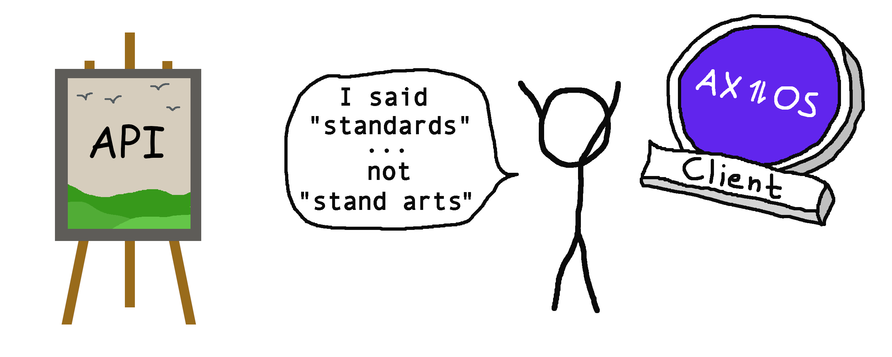

<p align="center">
  <br>
  <br>
  
  <br>
  <br>
  Create type safe client API instances based on
  <a href="https://github.com/tectonique/api-standards">tectonique/api-standards 🔗</a>.
  <br>
  <br>
</p>

# 🌩 API Standards – Client
This library is based on [tectonique/api-standards 🔗](https://github.com/tectonique/api-standards).

It provides client utilities to make API requests and error handling 100% type safe.

Currently, type wrappers are provided for:
- [axios 🔗](https://github.com/axios/axios)

# 📖 Table of contents

<!-- TOC -->
* [🌩 API Standards – Client](#-api-standards--client)
* [📖 Table of contents](#-table-of-contents)
* [📦 NPM Package](#-npm-package)
* [💾 Installation](#-installation)
* [🏁 Goal](#-goal)
* [📑 Documentation](#-documentation)
  * [💠 Axios with type safety](#-axios-with-type-safety)
* [📜 Changelog](#-changelog)
* [🦔 Author](#-author)
<!-- TOC -->

# [📦 NPM Package](https://www.npmjs.com/package/@tectonique/api-standards-client)

# 💾 Installation

Using npm:
```bash
npm i @tectonique/api-standards-client
```

Using yarn:
```
yarn add @tectonique/api-standards-client
```

# 🏁 Goal
When you have
- a type safe backend setup using [tectonique/api-standards 🔗](https://github.com/tectonique/api-standards/) or [tectonique/api-standards 🔗](https://github.com/tectonique/api-standards-nestjs/),
- an exposed `ProblemDetailsSuperType`
- and this library installed
you can create e.g. fully typed axios instances with error/Problem Detail handling!

You want to perform such API calls:
```typescript
const createUserEnvelope = await MyApi.createUser(
  "theo@testing.com",
  "Theo Tester"
);

if (createUserEnvelope.success) {
  console.log("User id: ", createUserEnvelope.payload.id);

} else if (createUserEnvelope.type === "response-not-an-envelope") {
  throw new Error("Response is not an envelope!");
}
```

# 📑 Documentation

## 💠 Axios with type safety
- Import your backend request/query/response types.
- Import your backend Problem Detail Super Type.
- Create a typable axios instance with `makeAxiosTypeSafe(axiosInstance)`.
- Create your custom API instance with methods that use `get|post|put|patch|delete` of the typeable axios instance.

An example:
Here is an example:
```typescript
import axios from "axios";
import { ProblemDetailSuperType } from "@backend/ProblemDetailSuperType"
import { makeAxiosTypeSafe, ClientProblemDetailSuperType } from "@tectonique/api-standards-client";

type Create_User_Body = {
  email: string;
  name: string;
};

type Create_User_Response = {
  id: string;
};

const typableAxios = makeAxiosTypeSafe<ProblemDetailSuperType | ClientProblemDetailSuperType>(axios);

const MyApi = {
  createUser: (email: string, name: string) =>
    typableAxios.post<Create_User_Response, Create_User_Body, undefined>(
      "/users",
      { email, name }
    ),
};

const createUserEnvelope = await MyApi.createUser(
  "theo@testing.com",
  "Theo Tester"
);

if (createUserEnvelope.success) {
  console.log("User id: ", createUserEnvelope.payload.id);
  
} else if (createUserEnvelope.type === "response-not-an-envelope") {
  throw new Error("Response is not an envelope!");
}
```

# [📜 Changelog](CHANGELOG.md)

# 🦔 Author
<p align="center">
  <b>Peter Kuhmann</b>
  <br>
  <a href="https://github.com/hedgehogs-mind">GitHub: hedgehogs-mind</a>
  <br>
  <br>
  <br>
  <b>Tectonique</b>
  <br>
  <br>
  
</p>